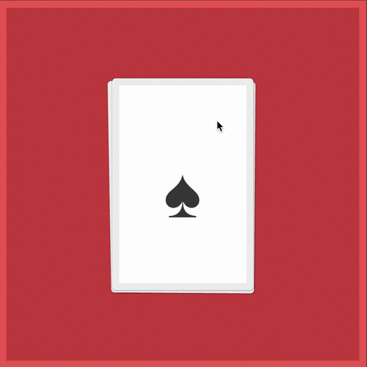

# Swing

A swipeable cards interface. The swipe-left/swipe-right for yes/no input. As seen in apps like [Jelly](http://jelly.co/) and [Tinder](http://www.gotinder.com/), and [many others](http://www.saydaily.com/2014/09/tinder-swipe-and-media).



## Quick Start

```html+js
<ul>
    <li></li>
    <li></li>
    <li></li>
</ul>
<script>
var stack,
    cards;

// Prepare the cards in the stack for iteration.
cards = [].slice.call(document.querySelectorAll('ul li'))

// An instance of the Stack is used to attach event listeners.
stack = new Swing.Stack();

cards.forEach(function (targetElement) {
    // Add card element to the Stack.
    stack.createCard(targetElement);
});

// Add event listener for when a card is thrown out of the stack.
stack.on('throwout', function (e) {
    // e.target Reference to the element that has been thrown out of the stack.
    // e.throwDirection Direction in which the element has been thrown (1 right, -1 left).

    console.log('Card has been thrown out of the stack.');
    console.log('Throw direction: ' + (e.throwDirection == 1 ? 'right' : 'left'));
});

// Add event listener for when a card is thrown in the stack, including the spring back into place effect.
stack.on('throwin', function (e) {
    console.log('Card has snapped back to the stack.');
});
</script>
```

## Usage Examples

* [Card stack](http://gajus.com/sandbox/swing/examples/card-stack/).

The code for all of the examples is in the [./examples/](https://github.com/gajus/swing/tree/master/examples/) folder.

[Raise an issue](https://github.com/gajus/swing/issues) if you are missing an example.

## Use Case

A collection of observations about the extended use case of the swipeable cards interface, that I found useful when considering the implementation.

### Single-Handed Navigation

> It's all in the thumb, says mobile expert Luke Wroblewski. Mobile devices are frequently used on-the-go, which drastically increases the probability that you'll attempt to navigate apps using just one hand, with the key digit being the mighty thumb.
> Instead of browsing endless lists for the hidden perfect piece of data — be it the right music for the moment, what to do tonight, or your next potential hookup — card-swiping turns decision making into a highly engaging Choose-Your-Own-Adventure game.

– https://medium.com/@janel_az/small-data-why-tinder-like-apps-are-the-way-of-the-future-1a4d5703b4b

### Digestible Unit of Information

> [..] the "card" on a mobile device becomes more and more important as a digestible unit of information on a small screen for users who are on the go and mostly glancing through their apps before settling into the ones that truly engage them.

– http://techcrunch.com/2013/09/22/mobile-apps-card-interfaces-and-our-opposable-thumbs/

### Data

> But card based UI has benefits beyond user joy. And while I could go on about how it helps developers organize content architecture, or how it helps copywriters and designers write and create for simple, incremental screens, there’s an even more compelling reason to take a closer look at this one. Because Card Based UX can yield a powerful by-product:  Data.  More than a scroll and perhaps even more than discrete taps themselves, cards create repetitive, deliberate, discrete decision moments over and over. And as the user swipes, you can learn.
> The time they swipe, the speed they swipe, what they swiped, the geolocation where they swiped, and even how similar the results of that swipe are vs. a swipe earlier that session are all possibilities that are yielding smarter apps for you and me every day.

– http://www.itsmakeable.com/unconventional-wisdom/good-user-experience-design-ux-can-do-what-now/

## Configuration

| Name | Description |
| --- | --- |
| `isThrowOut` | Invoked in the event of `dragend`. Determine if element is being thrown out of the stack. Element is considered to be throw out if it has been moved at least 10px outside of the stack box. |
| `throwOutDistance` | Invoked when card is added to the stack. The card is thrown to this offset from the stack. The value is a random number between `minThrowOutDistance` and `maxThrowOutDistance`. |
| `minThrowOutDistance` | In effect when `getThrowOutDistance` is not overwritten. Default: 400. |
| `maxThrowOutDistance` | In effect when `getThrowOutDistance` is not overwritten. Default: 500. |
||

All of the configuration parameters are optional.

## Events

Use an instance of the `Swing.Stack` to attach event listeners:

```js
var stack;

stack = stack = new Swing.Stack();

stack.on('throwout', function () {});
```

| Name | Description |
| --- | --- |
| `throwout` | When card has been thrown out of the stack. |
| `throwin` | When card has been thrown into the stack, including the spring back into place effect. |
| `dragstart` | Hammer [panstart](http://hammerjs.github.io/recognizer-pan/). |
| `dragmove` | Hammer [panmove](http://hammerjs.github.io/recognizer-pan/). |
| `dragend` | Hammer [panend](http://hammerjs.github.io/recognizer-pan/). |

### Event Object

Event listener is invoked with a single `eventObject` parameter:

```js
var stack;

stack = stack = new Swing.Stack();

stack.on('throwout', function (eventObject) {});
```

| Name | Value |
| --- | --- |
| `target` | The element being dragged. |
| `direction` | The direction in which the element is being dragged: `Card.DIRECTION_LEFT` or `Card.DIRECTION_RIGHT`. |

## Dependencies

If you are using the `./dist/` version, you do not need to download the dependencies.

The list of the dependencies and description of their role is for your reference only.

* [Rebound](http://facebook.github.io/rebound-js/docs/rebound.html) to drive physical animations. Notice how if you drag too little and let go, the cards spring back into place.
* [Hammer](http://hammerjs.github.io/) to handle drag interactions.

## Todo

* Animate the card stack underneath the current card.